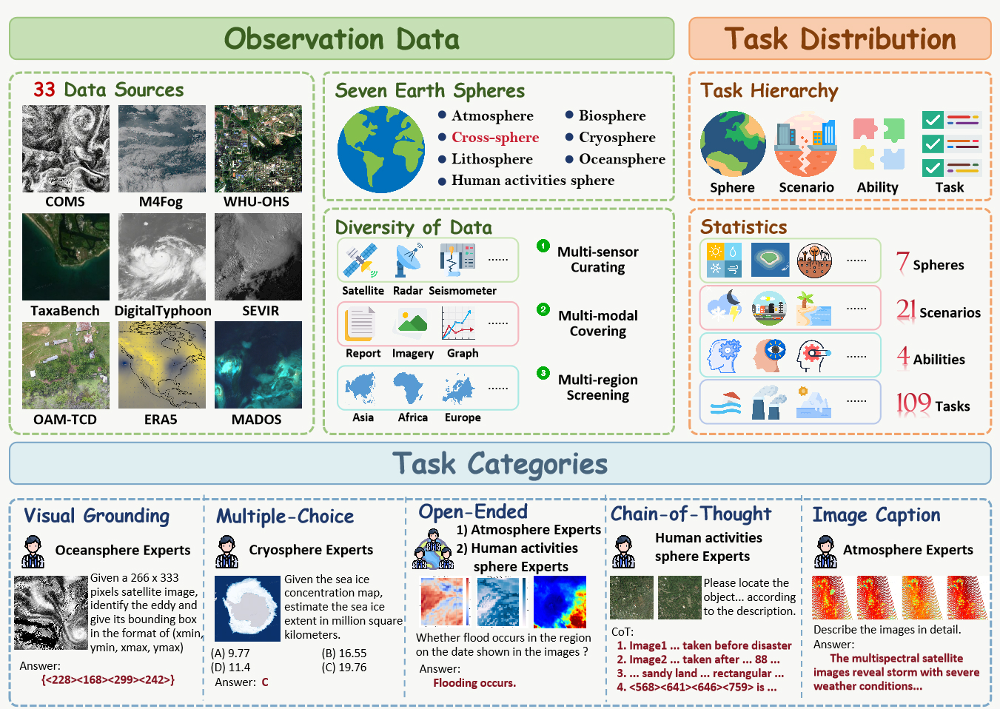
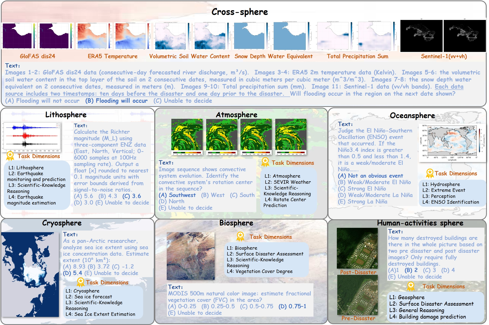

<div align="center">
  <h2><strong>OmniEarth-Bench</strong></h2>
  <h5>
  Anonymous Authors
      <br/><br/>
  </h5>
</div>

## 📚 Contents

- [📚Contents](#-contents)
- [🔍Dataset Overview](#dataset-overview)
- [📸Dataset](#dataset)
- [🚀Evaluation](#evaluation)

## 🔍Dataset Overview



<p align="center"><strong>Fig 1. Overview of OmniEarth-Bench.</strong></p>

​	We introduce **OmniEarth-Bench**, the first comprehensive multimodal benchmark spanning all six Earth science spheres (**atmosphere, lithosphere, Oceansphere, cryosphere, biosphere and Human-activities sphere**) and **cross-spheres** with one hundred expert-curated evaluation dimensions. Leveraging observational data from satellite sensors and in-situ measurements, OmniEarth-Bench integrates 29,779 annotations across four tiers: **perception, general reasoning, Scientific‑knowledge reasoning and chain-of-thought (CoT) reasoning**. The key contributions are:

* **Comprehensive Evaluation Across All Six Spheres**. OmniEarth-Bench is the first benchmark to extensively cover all Earth science spheres, offering 58 practical and comprehensive evaluation dimensions that significantly surpass prior benchmarks.
* **Pioneering Cross-Sphere Evaluation Dimensions**. To address complex real-world scenarios, OmniEarth-Bench introduces cross-sphere evaluation capabilities for societally important tasks such as disaster prediction and ecological forecasting.
* **CoT-Based Reasoning Evaluations in Earth Science**. OmniEarth-Bench establishes, for the first time, CoT-based evaluations tailored for complex Earth science reasoning tasks, addressing scenarios where previous benchmarks showed near-zero accuracy, and explores how CoT strategies might enhance reasoning capabilities in the Earth domain.

## 📸Dataset

​	OmniEarth-Bench defines tasks across four hierarchical levels (L1–L4), comprising 7 L1 dimensions, 23 L2 dimensions, 4 L3 dimensions, and 103 expert-defined L4 subtasks with real-world applicability. One representative L4 subtask from each L1 sphere is illustrated in Fig 2. Detailed descriptions of the L3 and L4 dimensions are provided in the paper's appendix.



<p align="center"><strong>Fig 2. Examples of OmniEarth-Bench.</strong></p>


## 🚀Evaluation

### MCQ/Visual Grounding/CoT

#### 1. Prepare data

* First download the dataset from huggingface through WebUI or `hf` CLI.

  **Datset URL**: https://huggingface.co/datasets/anonymous-my-repo/OmniEarth-Bench
* Unzip raw.tar, and copy `jsons/` and `raw/` into `prepare_data/`.
* Run `mk_shards.py`. This will generate parquet files used in evaluation.

#### 2. Prepare task config

* Enter the `task_config/` folder and run `mk_yaml.py`. This will generate yaml task files, each of which stands for a L2 task used in `lmms-eval`.

  **Note:** to evaluate CoT tasks, you need to manually update the parquet path in `cot.yaml`.

* Install [lmms-eval](https://github.com/EvolvingLMMs-Lab/lmms-eval?tab=readme-ov-file#installation) and copy `task_config/` into `lmms_eval/tasks/`

#### 3. Benchmark

##### 3.1 MCQ

To test on L1 task `Atmosphere`, for example, run the following command:

```bash
TASKS="Atmosphere"	# A tag, can also be Biosphere, Pedosphere, etc.
MODEL="qwen2_5_vl"
PRETRAINED_MODEL="Qwen/Qwen2.5-VL-7B-Instruct"
MODEL_ARGS="pretrained=${PRETRAINED_MODEL},use_flash_attention_2=True"
LOG_SUFFIX="${MODEL}_${TASKS}"

accelerate launch --num_processes 8 --main_process_port 12345 -m lmms_eval \
    --model "qwen2_5_vl" \
    --model_args ${MODEL_ARGS}  \
    --tasks ${TASKS} \
    --batch_size 1 \
    --log_samples \
    --log_samples_suffix ${LOG_SUFFIX} \
    --output_path ./logs/
```

Check the yaml files for task names to run. The key `task` for each L2 tasks and `tag` for L1 tasks. 

##### 3.2 Visual Grounding

```bash
TASKS="Lithosphere_vg"	# A task tag, take visual grounding of Lithsphere as an example
MODEL="qwen2_5_vl"
PRETRAINED_MODEL="Qwen/Qwen2.5-VL-7B-Instruct"
MODEL_ARGS="pretrained=${PRETRAINED_MODEL},use_flash_attention_2=True"
LOG_SUFFIX="${MODEL}_${TASKS}"

accelerate launch --num_processes 8 --main_process_port 12345 -m lmms_eval \
    --model "qwen2_5_vl" \
    --model_args ${MODEL_ARGS}  \
    --tasks ${TASKS} \
    --batch_size 1 \
    --log_samples \
    --log_samples_suffix ${LOG_SUFFIX} \
    --output_path ./logs/
```

##### 3.3 CoT

* Generate model response using lmms-eval.

  ```bash
  TASKS="OmniEarth_cot"	# A task tag, take visual grounding of Lithsphere as an example
  MODEL="qwen2_5_vl"
  PRETRAINED_MODEL="Qwen/Qwen2.5-VL-7B-Instruct"
  MODEL_ARGS="pretrained=${PRETRAINED_MODEL},use_flash_attention_2=True"
  LOG_SUFFIX="${MODEL}_${TASKS}"
  
  accelerate launch --num_processes 8 --main_process_port 12345 -m lmms_eval \
      --model "qwen2_5_vl" \
      --model_args ${MODEL_ARGS}  \
      --tasks ${TASKS} \
      --batch_size 1 \
      --log_samples \
      --log_samples_suffix ${LOG_SUFFIX} \
      --output_path ./logs/
  ```

* Follow [MME-CoT](https://github.com/MME-Benchmarks/MME-CoT) to calculate precision and recall for each model.

  ```bash
  # precision
  python main.py --name precision --num_threads 20 \
  --prompt_path prompt/prompt_precision.txt \
  --data_path  lmms-eval/cot/MME-CoT/results/json/onevison_mmecot_reasoning_test_for_submission.xlsx \
  --cache_dir cache/onevision/precision \
  --model  internlm3-latest
  # recall
  python main.py --name recall --num_threads 20 \
  --prompt_path prompt/prompt_recall.txt \
  --data_path lmms-eval/cot/MME-CoT/results/json/intern_mmecot_reasoning_test_for_submission.xlsx \
  --cache_dir cache/intern/recall/ \
  --model  internlm3-latest
  ```

  

### Open-ended

We utilize online API for convinience and simplicity. Take gpt-4o as an example:

```bash
# 1. install custom library, install `omniearth` from the evaluation folder
cd evaluation/open_caption
uv pip install -e .
# 2. prompting, please configure OPENAI_KEY first
mkdir models && cd models
python -m omniearth.eval.prompt_open -t jsons_open/open_ended_tasks.json -x 16 --max -1  -m gpt-4o
# 3. llm-as-judge
# cd models/<model>
cd gpt-4o
python -m omniearth.eval.eval_open --task-base . -t jsons_open/open_ended_tasks.json -x 16 --max -1  -m gpt-4o
# 4. scoring
python -m omniearth.eval.scoring --task-base . -t jsons_open/open_ended_tasks.json --strict
```

### Captioning

```bash
# 1. make sure the `omniearth` library is installed
cd evaluation/open_caption
uv pip install -e .
# 2. prompting, please configure OPENAI_KEY first
mkdir models2 && cd models2
python -m omniearth.eval.prompt_open --task-base /caption_data\jsons --image-base /caption_data\images -t caption_data/caption_tasks.json -x 16 --max -1  -m gpt-4o
# 3. eval & scoring
# cd models2/<model>
cd gpt-4o
python -m omniearth.eval.eval_caption --task-base . -t caption_data/caption_tasks.json
```
